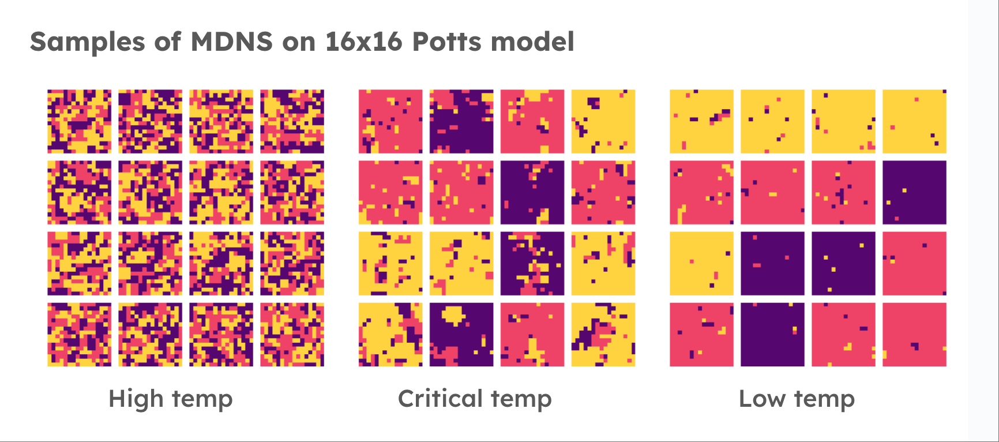
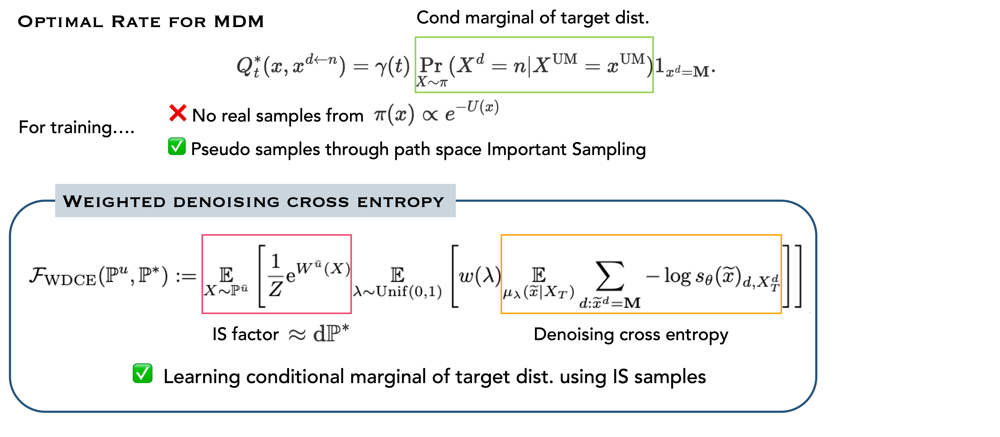

# MDNS: Masked Diffusion Neural Sampler via Stochastic Optimal Control

[](https://arxiv.org/abs/2508.10684)
[](LICENSE)
[](https://x.com/YuchenZhu_ZYC/status/1963269587413168524)

Welcome to the official implementation for **MDNS** (accepted at NeurIPS 2025), for  training <span style="color:#A020F0">**neural samplers**</span> for discrete distribution with <span style="color:#A020F0">**masked discrete diffusion models.**</span>




## Environment
```
conda env create -f environment.yml
conda activate mdns
```

## Training
The commands for training MDNS on Ising and Potts models are listed in `train_commands.sh`

## Checkpoints
We included checkpoints trained with MDNS for Ising and Potts model on 2D square lattice under the folder `checkpoints`. 

- For Ising model, we include those on $16\times16$ and $24\times24$ square lattices, across three different inverse temperatures $\beta_{\text{high}} = 0.28$, $\beta_{\text{critical}} = 0.4407$, and $\beta_{\text{low}} = 0.6$. We named them correspondingly as `ising_high.pth`, `ising_crit.pth` and `ising_low.pth` under the directory.
- For Potts model, we include those on $16\times16$ square lattice with $q=3$, across three different inverse temperatures $\beta_{\text{high}} = 0.5$, $\beta_{\text{critical}} = 1.005$, and $\beta_{\text{low}} = 1.2$. We named them correspondingly as `potts_high.pth`, `potts_crit.pth` and `potts_low.pth` under the directory.


## Metadynamics Sampling

We support Metadynamics (MTD) sampling to enhance exploration during training. This is particularly useful for systems with high free energy barriers between distinct states.

### Hyperparameters

Standard MTD suggests an initial bias height of $0.1$ to $0.5$ $k_B T$. However, for diffusion samplers (like MDNS) that deposit bias more frequently (batch updates), we will scale the height by the batch size $B$.

The recommended **effective parameters** are:
- **Bias Factor ($\gamma$)**: Controls the effective temperature along CVs. Higher values lead to more exploration. For generative models, we recommend 5-10.
- **Bias Height ($h$)**: Should be reduced by the batch size $B$.

$$
h_{\text{eff}} \approx \frac{\text{Standard Height}}{B} = \frac{(0.1 \sim 0.5) k_B T}{B}
$$


#### Ising Model (Temperature-dependent Choices)
For Ising Model ($16\times16$), with batch size $B=256$:
- **Low Temp ($T \approx 1.667, \beta=0.6$)**:
    - Standard Height ($0.1 \sim 0.5 k_B T$): $0.1667 \sim 0.8335$
    - Normalized Height ($/ 256$): **$0.00065 \sim 0.0033$**. Recommended: **$0.001$**
- **Crit Temp ($T \approx 2.269, \beta \approx 0.44$)**:
    - Standard Height ($0.1 \sim 0.5 k_B T$): $0.2269 \sim 1.1345$
    - Normalized Height ($/ 256$): **$0.0009 \sim 0.0044$**. Recommended: **$0.001$**
- **High Temp ($T \approx 3.571, \beta=0.28$)**:
    - Standard Height ($0.1 \sim 0.5 k_B T$): $0.3571 \sim 1.7855$
    - Normalized Height ($/ 256$): **$0.0014 \sim 0.0070$**. Recommended: **$0.002$**

#### CuAu Alloy (Temperature-dependent Choices)
For CuAu ($4\times4\times4$), with batch size $B=128$:
- **Low Temp (200K, $k_B T \approx 0.0172 \text{ eV}$)**:
    - Standard Height ($0.1 \sim 0.5 k_B T$): $0.00172 \sim 0.0086 \text{ eV}$
    - Normalized Height ($/ 128$): **$0.000013 \sim 0.000067 \text{ eV}$**
- **Crit Temp (680K, $k_B T \approx 0.0586 \text{ eV}$)**:
    - Standard Height ($0.1 \sim 0.5 k_B T$): $0.00586 \sim 0.0293 \text{ eV}$
    - Normalized Height ($/ 128$): **$0.000045 \sim 0.00023 \text{ eV}$**
- **High Temp (1200K, $k_B T \approx 0.1034 \text{ eV}$)**:
    - Standard Height ($0.1 \sim 0.5 k_B T$): $0.01034 \sim 0.0517 \text{ eV}$
    - Normalized Height ($/ 128$): **$0.00008 \sim 0.00040 \text{ eV}$**

#### Potts Model q=3 (Temperature-dependent Choices)
For Potts Model ($4\times4$, $q=3$), with batch size $B=128$:
- **Low Temp ($T \approx 0.833, \beta=1.2$)**:
    - Standard Height ($0.1 \sim 0.5 k_B T$): $0.0833 \sim 0.4165$. Recommended: **$0.0833$** 
    - Normalized Height ($/ 128$): **$0.00065 \sim 0.00325$**. 
- **Crit Temp ($T \approx 0.995, \beta=1.005$)**:
    - Standard Height ($0.1 \sim 0.5 k_B T$): $0.0995 \sim 0.4975$. Recommended: **$0.0995$** 
    - Normalized Height ($/ 128$): **$0.00078 \sim 0.00388$**. 
- **High Temp ($T = 2.0, \beta=0.5$)**:
    - Standard Height ($0.1 \sim 0.5 k_B T$): $0.2 \sim 1.0$. Recommended: **$0.2$** 
    - Normalized Height ($/ 128$): **$0.00156 \sim 0.00781$**. 

> Note: For Potts 4x4, we use 2D collective variables (CVs) based on state concentrations projected onto a triangular coordinate system. The CV bounds are typically set to `--cv_min "-0.6,-1.0" --cv_max "1.1,1.0"` with a grid size of 17. The bias height values shown above are the **raw heights** before batch normalization (which is applied automatically during training).

### Sample Commands

Below are sample commands using the recommended settings.

**Ising 16x16 (Low Temp)**
```bash
python train_ising.py \
    --L 16 \
    --beta 0.6 \
    --loss_fn wdce \
    --resample_every_n_step 10 \
    --wdce_num_replicates 10 \
    --use_bias \
    --bias_sigma 0.05 \
    --bias_height 0.1667 \
    --batch_size 256 \
    --hidden_size 64 \
    --n_blocks 6
```

**CuAu 4x4x4 (Low Temp)**
```bash
python train_cuau.py \
    --size 4 4 4 \
    --temp_min 200 --temp_max 200 \
    --loss_fn wdce \
    --resample_every_n_step 5 \
    --wdce_num_replicates 16 \
    --use_bias \
    --bias_sigma 0.05 \
    --bias_height 0.00172 \
    --batch_size 128 \
    --n_embed 64 \
    --n_layers 4
```

**Potts 4x4 q=3 (Low Temp)**
```bash
python train_potts.py \
    --L 4 \
    --q 3 \
    --beta 1.2 \
    --J 1 \
    --loss_fn wdce \
    --resample_every_n_step 5 \
    --wdce_num_replicates 16 \
    --use_bias \
    --bias_sigma "0.05" \
    --bias_height 0.0833 \
    --bias_factor 10 \
    --bias_grid_size "17" \
    --kernel_type "gaussian" \
    --cv_min "-0.6,-1.0" \
    --cv_max "1.1,1.0" \
    --batch_size 128 \
    --num_epochs 20000
```
> Note: For Potts 4x4, the model uses 128 embedding size, 4 blocks, and 4 heads (defaults in `train_potts.py`). The loss function defaults to `wdce` with `--resample_every_n_step 10` and `--wdce_num_replicates 8`, but these can be customized via command-line arguments. The example above uses `--resample_every_n_step 5` and `--wdce_num_replicates 16` for more frequent resampling. The bias height `0.4165` is automatically normalized by batch size during training.

### Replay Buffer
You can also use an experience replay buffer to stabilize training by mixing in past samples.
```bash
--buffer_size 1000 --buffer_ratio 0.5
```

## Evaluation
We include evaluation and visualization script of Ising and Potts model in `ising_model_eval.ipynb` and `potts_model_eval.ipynb` respectively. 


## Citation
If you find our work and repo help, we would appreciate your citations :smiling_face_with_three_hearts:


```
@inproceedings{zhu2025mdns,
  title     = {{MDNS}: Masked Diffusion Neural Sampler via Stochastic Optimal Control},
  author    = {Zhu, Yuchen and Guo, Wei and Choi, Jaemoo and Liu, Guan-Horng and Chen, Yongxin and Tao, Molei},
  booktitle = {The Thirty-ninth Annual Conference on Neural Information Processing Systems},
  year      = {2025},
  url       = {https://openreview.net/forum?id=xIH95kXNR2}
}
```


## Acknowledgement

Our code is partially based on the [rope-vit](https://github.com/naver-ai/rope-vit) repository (under Apache License 2.0).