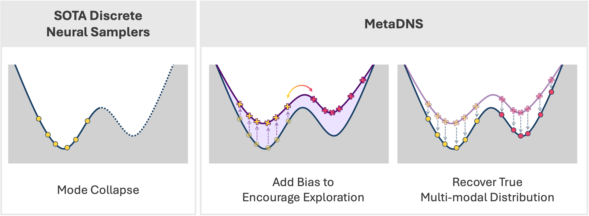

# MetaDNS: Metadynamics Discrete Neural Sampler

[](https://openreview.net/forum?id=OY7Qe2ZSx9)
[](https://github.com/xiaochendu/metadns)
[](LICENSE)

Welcome to the official implementation of **MetaDNS** — a framework that combines **learned sampling** with **Well-Tempered Metadynamics (WT-ASBS)** to train <span style="color:#A020F0">**neural samplers**</span> for discrete distributions, with enhanced exploration of complex free energy landscapes.

> Builds on **MDNS** (NeurIPS 2025) — [paper](https://openreview.net/forum?id=xIH95kXNR2), [arXiv:2508.10684](https://arxiv.org/abs/2508.10684).



## Installation

```bash
git clone https://github.com/xiaochendu/metadns.git
cd metadns

# Create an environment (Python 3.10) and install
conda create -n metadns python=3.10 -y
conda activate metadns
pip install -e .          # add ".[dev]" for pytest + notebook
```

A conda specification (`environment.yml`) is also provided as an alternative. Run all
commands below from the repository root.

## Repository Layout

```
metadns/
├── train_ising.py / train_potts.py / train_cuau.py   # training entry points
├── scripts/
│   ├── mdns_sampling.py        # sample from a trained checkpoint
│   ├── mcmc_biased_sampling.py # MCMC sampling with a pre-trained bias
│   └── resume_training.py      # resume training from a checkpoint
├── bias.py                     # Well-Tempered Metadynamics bias potential
├── model/                      # neural network definitions (RoPE ViT, transformer)
├── baselines/                  # vendored MCMC baseline samplers (block, Swendsen–Wang)
├── data/cuau/                  # CuAu input data (VASP supercell + ECI parameters)
├── checkpoints/                # pre-trained weights (download from Zenodo, see below)
├── examples/                   # sample reproduction notebooks (run against Zenodo data)
└── tests/                      # unit tests
```

## Metadynamics

MetaDNS deposits one Gaussian hill per sample, per deposition cycle, along low-dimensional
collective variables. Key knobs:

- **`--bias_height`** — the *total* height deposited per cycle, in the standard
  metadynamics range of $0.1\!-\!0.5\,k_BT$. It is divided by `--batch_size` internally so
  the deposited bias is independent of batch size (disable with `--no_normalize_bias_by_batch`).
- **`--bias_factor`** ($\gamma$) — the well-tempered factor; we use `10`.
- **`--bias_sigma`** — the hill width; we use `0.05`.
- **`--bias_grid_size`** — CV grid resolution; scales with system size.

## Training

All experiments use the WDCE loss with metadynamics (`--use_bias`). One representative
command is shown per system below. The full per-size and per-temperature hyperparameters
(`bias_height`, `bias_grid_size`, replay-buffer use, training length) are tabulated in the
paper appendix. Set `--dir_name` to your output directory.

### Ising

```bash
python train_ising.py \
    --L 16 --beta 0.6 --J 1 \
    --use_bias --bias_sigma 0.05 --bias_height 0.1667 --bias_factor 10 \
    --bias_grid_size 257 --kernel_type gaussian --cv_min -1 --cv_max 1 \
    --loss_fn wdce --resample_every_n_step 5 --wdce_num_replicates 8 \
    --batch_size 128 --hidden_size 64 --n_blocks 4 --n_heads 4 --dtype bfloat16 \
    --num_epochs 20000 \
    --buffer_size 1024 --buffer_ratio 0.5 --buffer_n_bins 8 --buffer_strategy balanced \
    --dir_name runs/ising_16x16_low
```

### Potts (q = 3)

```bash
python train_potts.py \
    --L 4 --q 3 --beta 1.2 --J 1 \
    --use_bias --bias_sigma 0.05 --bias_height 0.0833 --bias_factor 10 \
    --bias_grid_size 17 --kernel_type gaussian \
    --cv_min "-0.6,-1.0" --cv_max "1.1,1.0" \
    --loss_fn wdce --resample_every_n_step 5 --wdce_num_replicates 8 \
    --batch_size 128 --num_epochs 20000 \
    --dir_name runs/potts_4x4_low
```

### CuAu alloy

```bash
python train_cuau.py \
    --size 4 4 4 \
    --input_file data/cuau/cuau_fcc_4x4x4_supercell.vasp \
    --eci_file data/cuau/CI_params_ECI_CuAu_Final_Submission.json \
    --temp_min 500 --temp_max 500 --num_temps 1 --field 0.0 \
    --use_bias --bias_sigma 0.05 --bias_height 0.02154 --bias_factor 10 \
    --bias_grid_size 65 --kernel_type gaussian \
    --cv_type composition --cv_min 0 --cv_max 1 \
    --loss_fn wdce --resample_every_n_step 5 --wdce_num_replicates 8 \
    --batch_size 128 --n_embed 64 --n_layers 4 --n_heads 4 \
    --num_epochs 20000 \
    --dir_name runs/cuau_4x4x4_low
```

## Checkpoints

Pre-trained **MetaDNS** checkpoints (with trained bias potentials) for all systems, sizes,
and temperatures are hosted on **Zenodo** (DOI: _to be finalized upon publication_).
Download the `data_{ising,potts,cuau}.tar.gz` archives and extract them into `checkpoints/`
— this is the single data root shared by the sampling commands and the example notebooks
below. After extraction the layout is `checkpoints/<system>/{mdns,metadns,...}/<run>/`. The
full set of reference run commands — including the MCMC, Swendsen–Wang, and WT-ASBS
baselines — ships alongside the checkpoints as `MetaDNS_run_commands.md`.

## Sampling

`scripts/mdns_sampling.py` draws samples from a trained MetaDNS checkpoint — the
`checkpoints/<system>/metadns/...` paths below come from the Zenodo release extracted as
described above. The bias potential is loaded automatically from the checkpoint; the
`--bias_*` arguments should match the values used during training (see the paper appendix).

### Ising

```bash
python scripts/mdns_sampling.py \
    --model-type ising --ckpt checkpoints/ising/metadns/16x16_low/weights_final.pth \
    --L 16 --embed-dim 64 --depth 4 --num-heads 4 --J 1.0 \
    --use_bias --bias_sigma 0.05 --bias_height 0.1667 --bias_factor 10.0 \
    --bias_grid_size 257 --kernel_type gaussian --cv_min -1 --cv_max 1 \
    --temps 1.666667 --fields 0.0 \
    --batch-size 1024 --num-samples 10000 \
    --output-folder outputs/ising_16x16_low
```

Temperatures: low `1.666667`, crit `2.269392`, high `3.571429`.

### Potts (q = 3)

```bash
python scripts/mdns_sampling.py \
    --model-type potts --ckpt checkpoints/potts/metadns/16x16_low/weights_final.pth \
    --L 16 --q 3 --embed-dim 128 --depth 4 --num-heads 4 --J 1.0 \
    --use_bias --bias_sigma 0.05 --bias_height 0.0833 --bias_factor 10.0 \
    --bias_grid_size 257 --kernel_type gaussian \
    --cv_min="-0.6,-1.0" --cv_max="1.1,1.0" \
    --temps 0.833333 --fields 0.0 \
    --batch-size 1024 --num-samples 10000 \
    --output-folder outputs/potts_16x16_low
```

Temperatures: low `0.833333`, crit `0.995025`, high `2.0`.

### CuAu alloy (4×4×4)

```bash
python scripts/mdns_sampling.py \
    --model-type cuau --ckpt checkpoints/cuau/metadns/4x4x4_low/weights_final.pth \
    --size 4 4 4 \
    --input-file data/cuau/cuau_fcc_4x4x4_supercell.vasp \
    --eci-file data/cuau/CI_params_ECI_CuAu_Final_Submission.json \
    --embed-dim 64 --depth 4 --num-heads 4 \
    --use_bias --bias_sigma 0.05 --bias_height 0.02154 --bias_factor 10.0 \
    --bias_grid_size 65 --cv_min 0 --cv_max 1 \
    --temps 500.0 --fields 0.0 \
    --batch-size 1024 --num-samples 10000 \
    --output-folder outputs/cuau_4x4x4_low
```

Multiple temperatures and fields can be passed at once (e.g. `--temps 500.0 680.0 1200.0`);
the script samples every (temperature, field) combination. Results are written to a pickle
file containing the sampled configurations, energies, effective sample sizes, free energies,
and (when metadynamics is used) the bias-potential grid and collective-variable values.

## Evaluation

Two example reproduction notebooks are included under `examples/`:

- `examples/ising_16x16_benchmark.ipynb` — Ising L=16 distribution and free-energy
  comparison (paper Figure 2).
- `examples/cuau_4x4x4_benchmark.ipynb` — Cu-Au 4×4×4 concentration and free-energy
  results (paper Figure 5).

Each notebook reads benchmark sample and checkpoint files from the Zenodo data release.
Download `data_ising.tar.gz` and `data_cuau.tar.gz` and extract them into `checkpoints/`
— the default data root — then run the notebooks (no further configuration needed).
To read the data from a different location, set the `METADNS_DATA_ROOT` environment
variable. The complete set of reproduction notebooks covering every paper figure ships
with the Zenodo release.

## Tests

```bash
pytest tests/
```

## Citation

If you find this work useful, please cite both papers:

```bibtex
@inproceedings{du2026metadns,
    title     = {{MetaDNS}: Metadynamics-enhanced Masked Diffusion Neural Sampler},
    author    = {Du, Xiaochen and Nam, Juno and Choi, Jaemoo and Guo, Wei and Edamadaka, Sathya and Sha, Junyi and Pan, Elton and Chen, Yongxin and Tao, Molei and G\'omez-Bombarelli, Rafael},
    booktitle = {Proceedings of the 43rd International Conference on Machine Learning},
    year      = {2026},
    url       = {https://openreview.net/forum?id=OY7Qe2ZSx9}
}

@inproceedings{zhu2025mdns,
    title     = {{MDNS}: Masked Diffusion Neural Sampler via Stochastic Optimal Control},
    author    = {Zhu, Yuchen and Guo, Wei and Choi, Jaemoo and Liu, Guan-Horng and Chen, Yongxin and Tao, Molei},
    booktitle = {The Thirty-ninth Annual Conference on Neural Information Processing Systems},
    year      = {2025},
    url       = {https://openreview.net/forum?id=xIH95kXNR2}
}
```

## Acknowledgement

Our code is partially based on the [rope-vit](https://github.com/naver-ai/rope-vit)
repository (Apache-2.0 License). Vendored MCMC baseline samplers (`baselines/`) are adapted
from the [snowy-flow](https://github.com/recisic/snowy-flow-dev) repository (MIT License).
